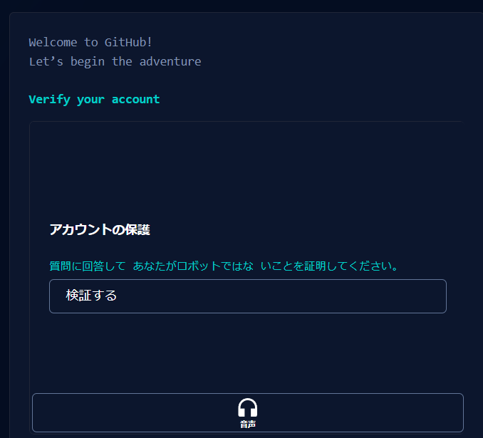

# GitHubを使えるようにしたい人へ

更新日：2024/11/15

## 目的

　サークルでGitHubを使えるようになりたい人のために作ってみました。

## 目次

1. [GitHubのアカウント作成](#githubのアカウントを作成)
1. [Gitのインストール](#gitのインストール)
1. [SSHキーの登録](#sshキーの登録)
1. [CloneからPushまで](#cloneからpushまで)

### GitHubのアカウントを作成

リポジトリを作るために、GitHubでアカウントを作る
以下のリンクでアカウントを作成できる

GitHubのリンク：https://github.co.jp/

アカウントの作り方は、次のようにメールアドレス（おすすめ：大学のメアド）、パスワード、ユーザー名の順に入力する。どれも登録したいように入力をする。入力が完了すると「Continue」のボタンが緑色になる。入力の確認ができたら、そのボタンをクリックして次に進む。

自身が人間であることの証明をする。「検証をする」を押して、質問に回答し証明する。

### Gitのインストール

Gitのコマンドを使うため、Gitのインストールを行う。

### SSHキーの登録

リモートで通信するために、SSHキーを登録する。

### CloneからPushまで

リポジトリ作成後の一連の流れをやってみる。
